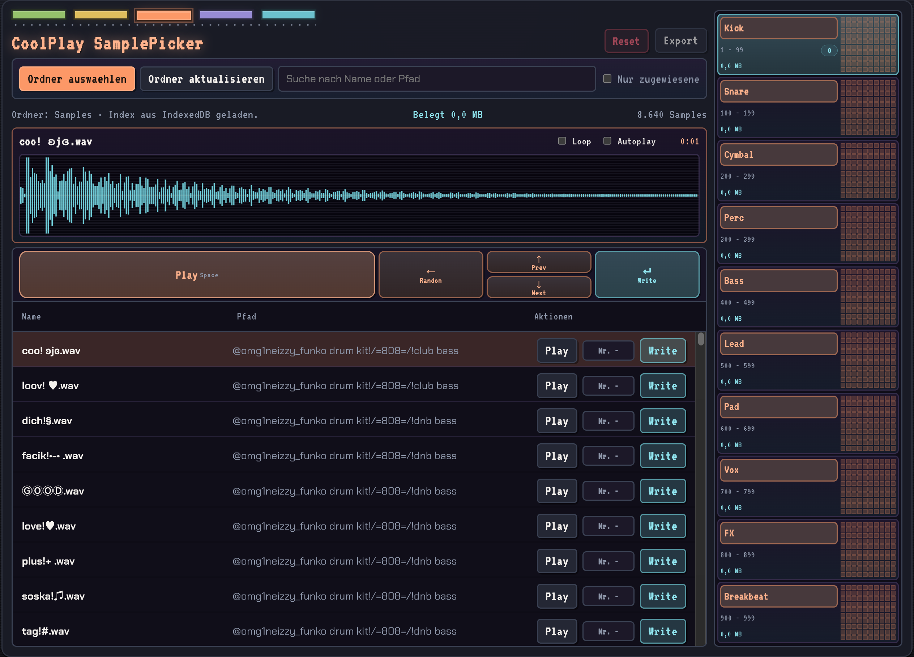

# CoolPlay Sample Picker MVP

I built this tool because picking samples for the Teenage Engineering KO II was more tedious than it should be. Doing that work inside a DAW like Ableton is possible, but it never felt fast or satisfying enough for the kind of high-volume sample sorting I wanted to do.

The goal of this prototype is to make the process feel quick, tactile, and keyboard-first. I genuinely enjoy scrolling through samples, so I wanted a workflow that makes that part as smooth and satisfying as possible while still being practical when sorting hundreds of sounds into the right KO II categories.

This app is designed to speed up that exact job: browse a large local sample library, assign sounds quickly with keyboard shortcuts, and export the final selection in a format that is convenient for the KO II workflow. Right now, it is a first prototype focused on speed, feel, and utility.

## Setup

1. `npm install`
2. `npm run dev`
3. Open the local URL shown in Chrome or Edge
4. Click `Choose folder` and grant access to your sample folder

## Notes

- The app uses the File System Access API and is intended for current desktop versions of Chrome or Edge.
- The index and saved sample assignments are stored in IndexedDB in the browser.
- `Refresh folder` rescans the most recently selected folder.
- Only `.wav` files are indexed.

## GitHub Pages Deployment

- The repository is prepared for GitHub Pages deployment via GitHub Actions.
- In GitHub, go to `Settings -> Pages` and choose `GitHub Actions` as the source.
- After that, every push to `main` will automatically deploy the static site.
- For this repository, the app is expected at `https://frankthefurter.github.io/DJ-Coolplay-Samplepicker/` as long as the repository name stays the same.
